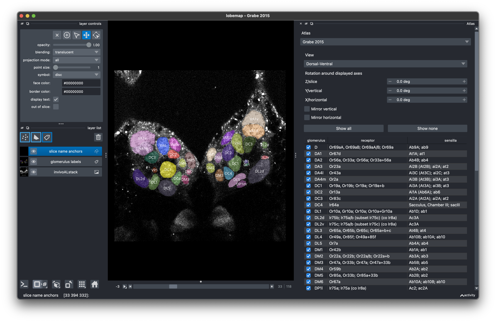
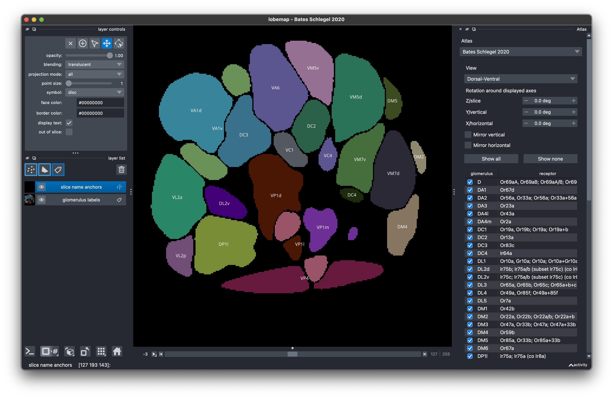
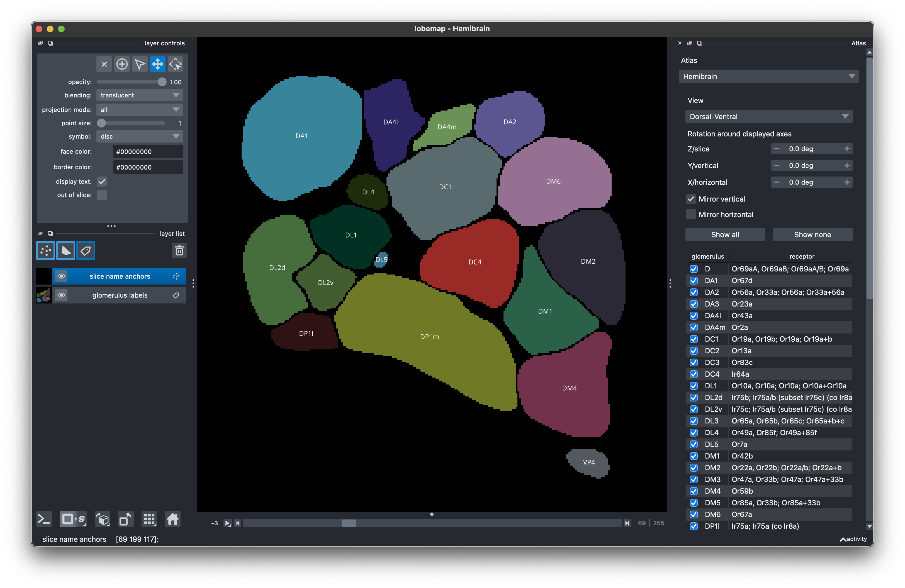
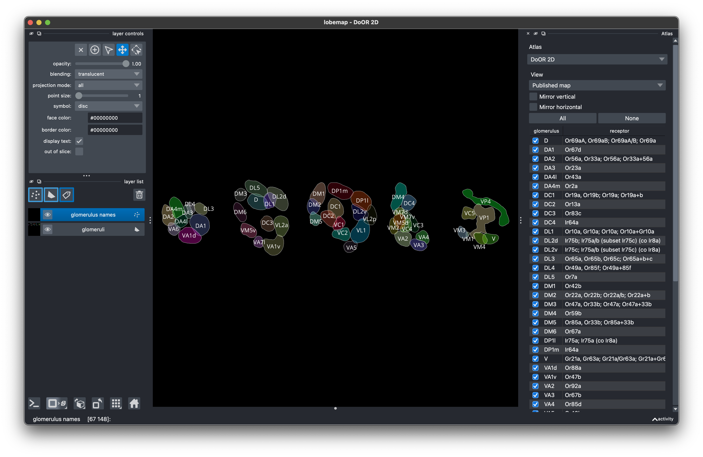

# lobemap

lobemap is a small napari viewer for Drosophila antennal lobe atlases.

https://github.com/user-attachments/assets/2b9711c9-3246-49c4-946b-a29fad0fce52

https://github.com/user-attachments/assets/d83978bd-f2de-48fe-9f0d-6aff19e3b663

It lets you:

- switch between atlases
- slice through 3D volumes
- show and hide glomeruli
- see glomerulus names, receptors, and sensilla
- compare reference maps and tables from different sources

## Reference Table

The [reference table](reference-tables/glomerulus_ground_truth.csv) is a
cross-dataset index for glomeruli, receptors, sensilla, ligands, valence,
driver lines, VFB IDs, and atlas coverage.

This preview shows selected columns only; it is not the full table schema.

| Glomerulus | Receptors | Sensillum | Key ligand | Valence | Receptor lines | Projection lines |
| --- | --- | --- | --- | --- | --- | --- |
| D | Or69aA, Or69aB | Ab9A | linalool | aversive | Orco-GAL4; Orco-T2A-QF2; Ir8a-T2A-QF2 | GH146-GAL4; ChAT-GAL4 |
| DA1 | Or67d | At1A | cis-vaccenyl acetate | mating/aggression | Orco-GAL4; Orco-T2A-QF2; Ir76b-T2A-QF2; Ir25a-T2A-QF2 | GH146-GAL4; ChAT-GAL4 |
| DA2 | Or56a, Or33a | Ab4B | geosmin | aversive | Orco-GAL4; Orco-T2A-QF2; Ir25a-T2A-QF2 | GH146-GAL4; ChAT-GAL4 |

Available columns: `canonical_glomerulus`, `receptor_consensus`,
`receptor_benton_2025`, `receptor_potter_task_2022`,
`receptor_odour_scenes`, `receptor_door`, `sensillum_consensus`,
`sensory_organ_consensus`, `sensillum_benton_2025`,
`sensory_organ_benton_2025`, `sensillum_potter_task_2022`,
`sensillum_odour_scenes`, `sensillum_door`, `sensory_organ_door`,
`neuron_name_benton_2025`, `essential_coreceptor_benton_2025`,
`co_receptor_door`, `orco_gal4_grabe_2015`, `orco_t2a_qf2`,
`ir8a_t2a_qf2`, `ir76b_t2a_qf2`, `ir25a_t2a_qf2`,
`key_agonists_benton_2025`, `sensory_scene_benton_2025`, `key_ligand`,
`odour_scene`, `valence`, `fbbt_id`, `vfb_name`, `vfb_synonyms`,
`projection_neuron_lines`, `projection_neuron_line_source`, `gh146_gal4`,
`gh146_pn_female`, `gh146_pn_male`, `chat_gal4`, `chat_soma_count`,
`chat_adpn`, `chat_lpn`, `chat_vpn`, `sensory_neuron_lines`,
`present_grabe_2015`, `present_hemibrain`, `present_flywire`,
`present_door_map`, `present_door_mappings`, `present_potter_task_2022`,
`present_benton_2025`, `present_bates_schlegel_2020`.

[Open the full table](reference-tables/glomerulus_ground_truth.csv) or the
[name reconciliation table](reference-tables/glomerulus_name_reconciliation.csv).

## Requirements

- `uv`
- A desktop environment that can open napari / Qt windows

Python and package dependencies are managed by `uv` from `pyproject.toml`.

## Start

```bash
uv sync
./lobemap
```

Choose an atlas from the dropdown in napari.

You can also open one atlas directly:

```bash
./lobemap --atlas flywire
```

## Generated Data

Some viewers use derived cache files under `data/derived/` for fast startup and
slicing. These generated files are tracked so a fresh checkout can open the
viewer without rebuilding caches. Rebuild all generated visual data after
source-data changes with:

```bash
uv run python scripts/regenerate_visual_data.py
```

The rebuild script uses the tracked source files and needs `pdftoppm` to render
the Potter Task 2022 PDF preview.

## What Is Included

- 3D atlas viewers for Grabe 2015, Bates Schlegel 2020, hemibrain, FlyWire,
  JRC2018Unisex, and Benton 2025
- 2D reference viewers for DoOR and Potter Task 2022
- Virtual Fly Brain and BANC resource lookup
- reference tables for glomerulus names, receptors, sensilla, and direct line labels

## Demo









## Data And Credit

This repo combines source data from several papers and public resources. Source
files are kept in `data/source/` folders when they can be shared. Paper PDFs are
not tracked in git.

See [docs/data-sources.md](docs/data-sources.md) for the source list and links.

## More

- [How to use lobemap](docs/usage.md)
- [Data sources](docs/data-sources.md)
- [Reference tables](reference-tables/README.md)

## License

Code in this repo is released under the MIT License. Data files keep the rights
and citation requirements of their original sources.
