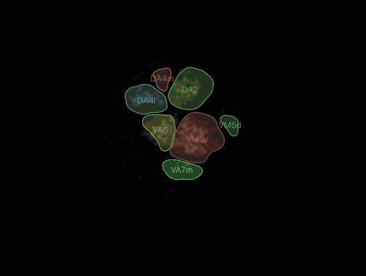
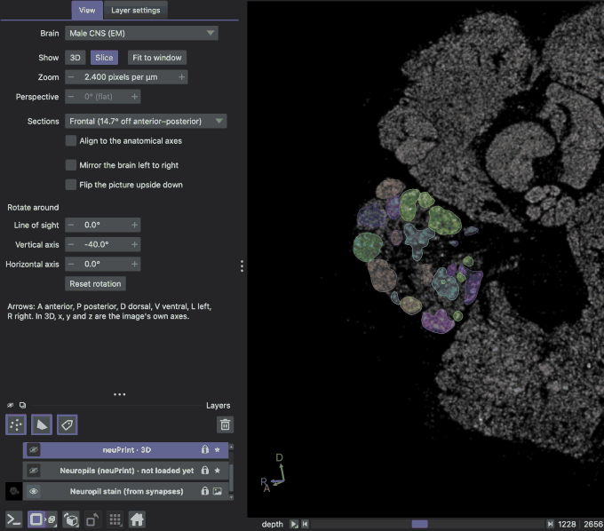
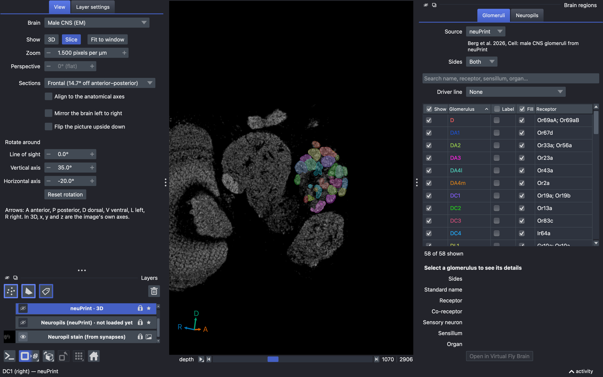
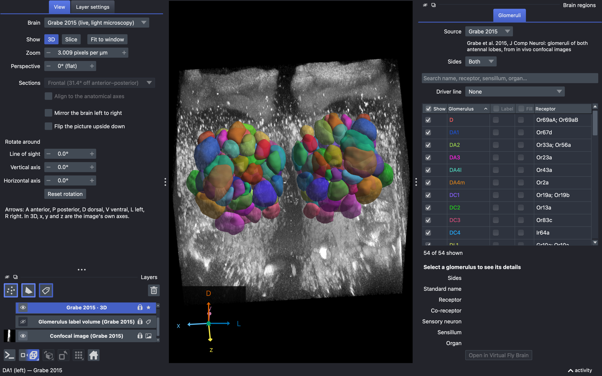

# Using the viewer

This page explains every part of the lobemap window: the **View** dock, napari's buttons, the layer list, the **Brain regions** panel, switching brains, and speed.

## The window

The window has three columns:

- **Left:** the **View** dock, in a tab beside napari's **Layer settings**. Under it is napari's **Layers** list, with a row of napari's buttons above the list and a row below it.
- **Middle:** the canvas, where the brain is drawn.
- **Right:** the **Brain regions** panel. It has a **Glomeruli** tab and, in every brain but GRABE, a **Neuropils** tab. Each tab has a source menu and a sides menu over its table.

The tabs of both columns look alike. Each row of tabs stands on a line in the open tab's color, across its column, so the open tab joins the section it shows.

The docks have no close button. If a dock is hidden, the Window menu shows it again.

## The View dock

Some controls work in one mode only, 3D or Slice view. In the other mode they stay in view but are disabled, and their tooltip says when they work.

The mouse wheel changes a box or a menu only after you click it or reach it with Tab. So scrolling over the dock changes nothing. The same is true for the panel's **Source**, **Sides** and **Driver line** menus. The wheel does not change the tab in either column.

### Brain

**Brain** opens another brain without a restart. The choices are FAFB (female, EM), Hemibrain (female, EM), Male CNS (EM) and Grabe 2015 (live, light microscopy). EM is electron microscopy. Only brains with data on disk are in the menu. The tooltip spells out the abbreviations and names the template the brain is shown in. [Switching brains](#switching-brains) says what a switch keeps.

### Show and Fit to window

**Show** switches between two modes:

- **3D** draws the meshes: the 3D surface of each glomerulus or neuropil.
- **Slice** draws one section at a time: the image, and the exact outline where each mesh crosses the section plane. The outlines stay sharp at any zoom.

**Fit to window** fits the brain to the window. In 3D it also turns back to the front view, dorsal side up, with the rotation applied. It frames the whole brain as that view shows it: turned, flipped and under perspective, with a hundredth of the window to spare on each side. It never moves the slice or the angles. The brain opens framed the same way, and napari fits it again in this way whenever you enter 3D.

### Zoom

**Zoom** is how large the brain is drawn, in screen pixels per micrometer of the brain. It is napari's own zoom factor: the number that napari's camera popup shows. Scrolling, **Fit to window** and the popup change it. Type a number to zoom to it. Zoom works in 3D and in Slice view.

### Perspective

**Perspective** is the field of view of the 3D camera. It goes from `0° (flat)`, the default, which has no perspective, to 90°, the strongest. It works in 3D only. In Slice view it is disabled. Hovering, the corner arrows, **Fit to window**, the rotation and the flip work the same under perspective.

### Sections and Align to the anatomical axes

**Sections** chooses which sections the slider steps through. Each choice names a plane and the anatomical axis that the slider steps along across it:

| plane | the slider steps along |
|---|---|
| Frontal | anterior–posterior |
| Horizontal | dorsal–ventral |
| Sagittal | medial–lateral |

By default, the sections follow the image grid, which is at an angle to the anatomy. Each choice also gives the angle between its anatomical axis and the image grid. For example, FAFB shows `Frontal (17.5° off anterior–posterior)`.

**Align to the anatomical axes**, off by default, cuts the sections square to the three anatomical axes instead. The menu then reads `Frontal (anterior–posterior)`.

Both controls work in Slice view only. In 3D they are disabled. The menu is as wide as the longest choice of any brain, aligned or not. So no choice is cut short, and the menu never changes width.

*Slice view steps through the sections. The outlines move with the image.*

### Mirror the brain left to right

**Mirror the brain left to right** shows the brain as its mirror image about its mid-plane. Use it to compare a left lobe with a right one.

It changes the display only. The data do not change, and the corner arrows follow the mirror. In 3D the camera then faces the front view turned by the angles, as a new angle puts it. So the mirror and the flip together are a 180° turn about the line of sight.

### Flip the picture upside down

**Flip the picture upside down** turns the picture over on screen, top to bottom, about the middle of the view. It applies after the rotation and the mirror, in 3D and in Slice view.

It changes the display only:

- No slider, plane or layer moves.
- The corner arrows follow the flip.
- Names on the slice stay readable.
- The surfaces stay lit from outside. Upside down they are lit from the lower right, as the upright picture is lit from the upper right. This stays true whatever moves you make while the flip is on.
- Turning it off gives back the view exactly.

With the mirror, a front view is turned 180°.

The only cost of the flip is the click: about 35 ms in Slice view and 4 ms in 3D. A slice step, or a change between 3D and Slice view, takes as long upside down as upright.

### Rotate around

**Rotate around** turns the view by three angles, about the axes of the screen. Each angle goes from −180° to 180°.

| row | a positive angle |
|---|---|
| **Line of sight** | turns the picture counterclockwise |
| **Vertical axis** | moves the near side to your right |
| **Horizontal axis** | brings the top toward you |

The rows are named by the axes of the screen, not by x, y and z. x, y and z are the image's own axes. They differ from the screen's axes once the slice axis changes.

**In 3D**, the camera turns from the front view, and no layer moves. Dragging still turns the camera freely and leaves the angles as they are. A new angle, or **Fit to window**, puts the camera back at the front view turned by the angles.

**In Slice view**, a turn about the **Line of sight** turns the section in the screen plane. A turn about the **Vertical axis** or the **Horizontal axis** cuts a true *oblique section*: a section at an angle to the image's own planes.

- The image is resampled on the turned plane.
- The outlines are exact sections of the meshes on that plane.
- The slider steps along your line of sight, and reads `depth`.
- napari's x/y/z arrows are hidden, because no image axis is on screen.

*As the angle changes, the section is cut again at the new angle.*

*An oblique section. The outlines are exact sections of the meshes on the turned plane.*

**Reset rotation** gives back exactly the unturned view. In 3D it also turns the camera back to the front view after a drag, even when the angles are at 0°.

### The corner arrows

The corner of the canvas shows arrows for the anatomy. Each arrow is labeled with the pole it points at: `A` or `P` (anterior or posterior), `D` or `V` (dorsal or ventral), and `L` or `R` (left or right). The legend under the controls says what the letters mean, in both views.

- **In 3D** the arrows turn in space. Beside them are napari's arrows for the image's own axes, `x`, `y` and `z`.
- **In Slice view** each arrow is the projection of its pole's direction onto the section, at any rotation, alignment, mirror and flip. A pole within 20.5° of the line of sight has no arrow, because its arrow would be under 35% of its length.

napari's x/y arrows are not shown in Slice view. The image grid is 5 to 31° off the anatomy, so the two sets of letters fell on top of each other.

### Controls from 0.1

For a frontal view, the controls of lobemap 0.1 map onto the new ones as follows:

| 0.1 | now |
|---|---|
| Z/slice | Rotate around **Line of sight** |
| Y/vertical | Rotate around **Vertical axis** |
| X/horizontal | Rotate around **Horizontal axis** |
| Mirror horizontal | **Mirror the brain left to right** |
| Mirror vertical | **Flip the picture upside down** |
| both mirrors, Benton's 0.1 default | both, which is a 180° turn: the same as **Line of sight** 180° |

## napari's buttons

napari's buttons are where napari puts them. Each one either works in step with the **View** dock, or is off and says why in its tooltip.

### Under the layer list

| button | what it does |
|---|---|
| **console** | napari's console |
| **2D/3D** | the same as **Show** |
| **roll** | steps to the next **Sections** choice, in the menu's order, and from the last choice back to the first; its key, ⌘E, does the same; off in 3D, as **Sections** is |
| **transpose** | off |
| **grid** | off |
| **home** | the same as **Fit to window**; keeps the rotation and the flip |

Each button and its **View** dock control follow the viewer, so using one updates the other.

### The camera popup

Right-click **2D/3D** to open napari's camera popup.

- Its up/down menu is **Flip the picture upside down**. Its zoom is **Zoom**. In 3D, its perspective is **Perspective**. Each one shows a change made in the other.
- Its angle sliders turn the camera as dragging does. The **Rotate around** boxes keep their values, and **Fit to window** goes back to them.
- Its left/right menu is off, and in 3D so is its depth menu. Either would show the brain mirrored, with no control to say so. To mirror the brain, use **Mirror the brain left to right**, or flip the picture and turn it 180° about the line of sight.
- Its **Sync 2D/3D camera** box is off too. View > Toggle Synced 2D/3D Camera (⌘U) says why and changes nothing. 3D and Slice view share one camera, so the zoom and the view that the dock shows stay the same when you change mode.

### The roll popup

Right-click **roll** to list the axes in the order the slice uses. Drag an axis to the top to slice along it, as **Sections** does. A drag that swaps the two axes on screen is undone, and a message says why.

### Transpose, grid and Scene Axes

**transpose** and **grid** are off, and so are their right-click settings. **transpose** would show the brain mirrored across the picture's diagonal. **grid** would draw the outlines apart from their image. Nothing in the **View** dock would show either one.

Their keys are off too. ⌘T, ⌘⌥T and ⌘G show a message and do nothing. ⌘⌥T is napari's turn of every layer by 90°, which Option-click on **transpose** also does. Any key that you bind to these actions in napari's Preferences also does nothing.

View > Scene Axes stays off too, and says why. napari draws those axes at the image's origin, outside the brain, and does not turn or mirror them with the brain.

### Above the layer list

Above the layer list are **new points**, **new shapes** and **new labels**, which add layers for you to draw in, and **delete**.

lobemap's own layers carry napari's lock:

- **delete**, ⌘⌫ and ⌘⌦ on the canvas, and ⌫ and ⌦ in the layer list skip them. A message says that they are part of the brain and that you can hide them instead.
- They stay locked if you unlock them from the layer menu.
- The layer menu's Duplicate and projections refuse them and say why. A copy would follow neither the panel nor the mirror and the rotation.
- Link Layers refuses them and says why. A link would hide an atlas in both modes.

Layers that you add delete, duplicate, project and link as usual.

## Layers

### The layer list

lobemap lists its layers, and draws them, in one order, top first:

1. each glomerulus atlas, the primary atlas first;
2. the neuropils;
3. the brain maps: the glomerulus label volume over the stain or the confocal image.

Each atlas and neuropil set has two layers next to each other: `· outlines`, drawn in Slice view, and `· 3D`. The order holds as parts are built, between 3D and Slice view, and after a brain switch. Layers that you add stay on top, where napari puts them.

### Blending and opacity

Every layer is translucent, and none is additive. Each layer is laid over the layers under it. So a glomerulus keeps its own color over the stain and the neuropils, in 3D and in Slice view.

The neuropils and the brain maps are drawn without depth, with napari's `translucent_no_depth` blending, so nothing inside them is hidden. The neuropils open at 10% opacity, which leaves the stain readable through all of a brain's neuropils. The glomeruli open at 75%. A blending or opacity that you set in **Layer settings** stays until you open another brain.

### Layer names and colors

Each layer is named by its atlas and what it draws: `Benton 2025 · 3D` for the meshes and `Benton 2025 · outlines` for the sections. A neuropil set also says where its data come from, as in `Neuropils (FlyWire) · 3D` and `Neuropils (neuPrint) · 3D`. The images are `Neuropil stain (from synapses)`, `Confocal image (Grabe 2015)` and, off by default, `Glomerulus label volume (Grabe 2015)`.

Each mesh layer's colormap is named after its atlas, as `Benton 2025 colors`. Where another brain has an atlas of the same name, the brain comes first, as `Male CNS neuPrint colors`. A brain's neuropils use `Hemibrain neuropil colors` and the like.

Each glomerulus keeps one color across the atlases of its brain: in 3D, on the slice and on its name.

Both the mesh layer and the outline layer stay in the list in either mode. The one that the mode cannot draw is switched off.

### Locked layers and your own layers

lobemap's layers are locked against napari's drawing and transform tools, which would move a mesh off its image. They are also locked against deletion. A layer that you add yourself is not locked.

A layer that you add is not mirrored, flipped or turned with the brain. A point placed on a turned section keeps its place while the brain turns back. So after **Reset rotation**, the point can lie off the glomerulus it was placed on.

### Reference images

A brain's reference image is the virtual neuropil stain in the three EM brains, or the confocal image in Grabe 2015. It is shown in grayscale whenever it has been fetched.

In 3D, a virtual stain first shows a coarser level of its pyramid. It sharpens, usually within a second, once the finest level that fits one GPU texture has been read in the background. Later visits to 3D show that level at once.

*Grabe 2015 shows its own confocal image under the glomeruli.*

To open the viewer with a layer that starts off already on, or to open in Slice view, use `lobemap view --show` or `--ndisplay 2`. [Commands](cli.md#view) explains both.

## Switching brains

A switch that succeeds keeps:

- the mode;
- the angles;
- the alignment;
- the perspective;
- the section plane, by its anatomy: frontal stays frontal, whichever image axis that is in the new brain.

These mean the same on screen in every brain. The switch clears the mirror and the flip, so a brain never opens reflected or upside down. Each brain opens its own tables, with its primary atlas checked.

A switch that fails says why under the controls. It leaves the brain you had exactly as it was: its checked rows, names, fills, searches, driver lines, open tab and sources, its slice and plane, the mode, the mirror, the flip, the angles, the alignment and the camera.

## The Brain regions panel

### Tabs and Source

The panel has two tabs, **Glomeruli** and **Neuropils**. GRABE has **Glomeruli** only.

**Source**, at the top of each tab, chooses which of the brain's atlases of that kind the table shows. The citation of the source is under the menu.

| brain | **Glomeruli** sources | **Neuropils** source |
|---|---|---|
| FAFB | Benton 2025 | FlyWire |
| Hemibrain | neuPrint, Schlegel (sensory), Schlegel (projection) | neuPrint |
| Male CNS | neuPrint | neuPrint |
| GRABE | Grabe 2015 | no **Neuropils** tab |

The menu and its citation sit in the same place in every brain, with one source or three. The menu is as wide as its longest source.

Choosing a source shows its table. It never changes what is drawn. Each source keeps its own checked rows, search and driver line.

### Sides

**Sides**, on its own row under **Source** and its citation, chooses which sides of each row the boxes act on: **Both**, the default, **Left** or **Right**.

- With **Right**, ticking `Show` on DA1 shows the right DA1 and leaves the left DA1 as it was.
- `Label`, `Fill`, the header checkboxes and **Driver line** also act on the chosen sides.
- A neuropil across the midline is on either side.

Each box shows its row on the chosen sides. It is ticked when every chosen side is on, and half ticked when some are. So a row whose right side alone is shown is half ticked under **Both**, and ticked under **Right**.

A row with none of the chosen sides has its boxes disabled. An example is any row of Benton 2025's left lobe under **Right**.

Each tab has its own choice, and a failed brain switch keeps it.

### Rows and columns

Each row is one glomerulus or neuropil, with every side that the atlas has of it. Its boxes act on the sides that **Sides** chooses, which is every side by default.

| table | columns |
|---|---|
| glomeruli | `Show`, `Glomerulus`, `Label`, `Fill`, `Receptor` |
| neuropils | `Show`, `Neuropil`, `Label`, `Fill` |

A missing value shows `—` everywhere.

A checked row is a drawn compartment, every chosen side of it, in 3D and in Slice view. A brain opens with its primary atlas checked and everything else unchecked. Hiding a layer with napari's eye unchecks its rows.

- `Label` writes the name on the slice, as the table has it and without the side, such as `DA1` or `MB_PED`. Where the name is shows the side.
- `Fill` fills the outline.

`Label` and `Fill` work in Slice view only, so in 3D their boxes are disabled.

### Header checkboxes, search and count

The `Show`, `Label` and `Fill` headers each have one checkbox for all the listed rows. The listed rows are the rows that the search keeps.

- The header checkbox is ticked when every listed row is ticked, and half ticked when some are.
- Clicking it ticks every listed row, or clears them all when all are ticked.
- The rows that the search hides keep their boxes as they are.

To show only the glomeruli that a search finds, clear the `Show` header first, then search, then tick the header. The `Invert` button is gone.

Under the table, the count says how many rows are shown, as `58 of 58 shown`. While a search hides rows, it also says how many the search lists: `5 listed · 58 of 58 shown`.

The search looks in the name of each side, also as published, and in the receptor, sensillum, organ and the other details of the table's kind. Click any other column header to sort by that column.

### Driver line

**Driver line**, under the search, shows only the glomeruli that a GAL4 or QF2 line labels, on the chosen sides. The lines come from the `sensory_neuron_lines` and `projection_neuron_lines` columns of the [reference table](../registry/reference/README.md), `registry/reference/glomerulus_ground_truth.csv`.

`Orco-GAL4 & GH146-GAL4` shows the glomeruli that both lines label. The menu lists the lines only. It reads `None` while no line is what is shown. Changing a row by hand sets it back to `None`.

### Details

Selecting a row fills the details under the table:

1. **Sides**: `Left`, `Right`, `Left and right` or `Midline`.
2. For a glomerulus: its standard name, receptor, co-receptor, sensory neuron, sensillum and organ, with **Open in Virtual Fly Brain**.
3. For a neuropil: its full name, and **Name from**, the source of that name.

A value that the sides do not share is given for each side, one line each, as `Left: …` and `Right: …`. A doubt that only some sides have is written after those sides in **Sides**. The name's tooltip gives each side's reason.

The details area keeps its size, with room for the longest value in the table. So selecting another row changes only the text.

### Hover and click

Hovering in the canvas names what is under the cursor in the status bar, for example `VA3 (left) — Benton 2025` or `AL, antennal lobe (right) — Neuropils (FlyWire)`.

- In 3D it names the mesh under the cursor. In Slice view it names the outline the cursor is inside.
- The name stays there while the cursor rests, whichever layer is active.
- Away from every compartment, the status bar shows napari's own words for the active layer.
- Hovering moves nothing in the panel.

A click that does not drag opens the row's tab, chooses its source, selects the row and fills the details. A drag turns or pans the view.

### When the other atlases are built

Only the primary atlas is built when a brain opens. The other atlases are read in the background. Each one is built, and joins napari's layer list, the first time its table is shown: when you choose it in **Source**, or, for the neuropils, when you open their tab.

A neuropil set that reaches past the rest of its brain waits in the layer list as a hidden layer, such as `Neuropils (FlyWire) · not loaded yet`, in the place its layer takes. So the sliders and the view are the same before and after it is built.

## Speed and memory while turned

At 0° none of the rotation code runs. Once the view is turned:

| action | time |
|---|---|
| a repeat step of the slider in Slice view | 2–4 ms in every brain |
| the first visit to an oblique plane | 5–24 ms; about 40 ms in the hemibrain at a compound angle |
| setting an oblique angle | 55–215 ms |

While turned, the hemibrain uses up to about 2.3 GB of memory, against 1.15 GB unturned.
